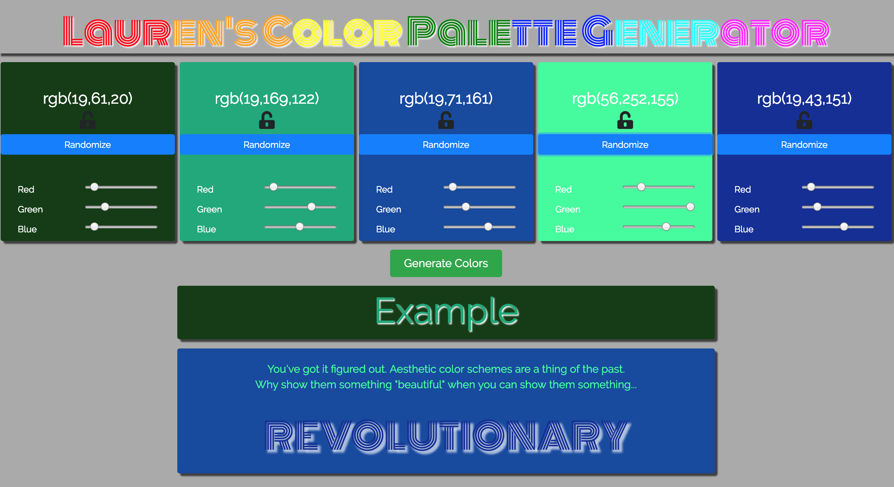

# Color Palette Generator
Created a color palette generator similar to the one found at Coolors.co

## Features
- The generator has the ability to create five colors with the press of a button.
  - Pressing the generate colors button will generate a pallete by keeping a single randomly generated red value the same across all five colors while randomizing the green and blue values.
- Each individual color can be locked by toggling the lock/unlock icon.
  - If a color is locked it can not be modified until unlocked.
- Three sliders on each color block represent red, green, and blue in the color and will update on change.
- The Example below the color blocks shows a basic site design using all of the colors in the generated color palette.
## Built With
- React
- Fonts.Google API
- Font-Awesome icons
- Bootstrap 4
